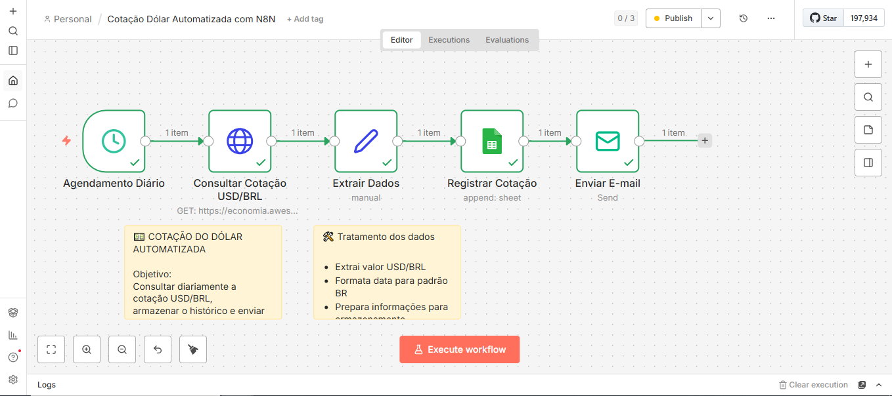
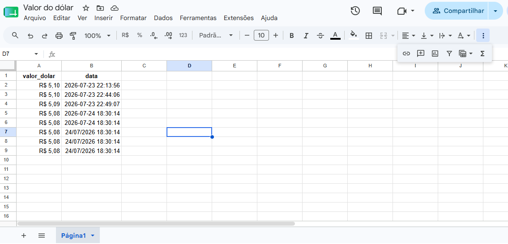
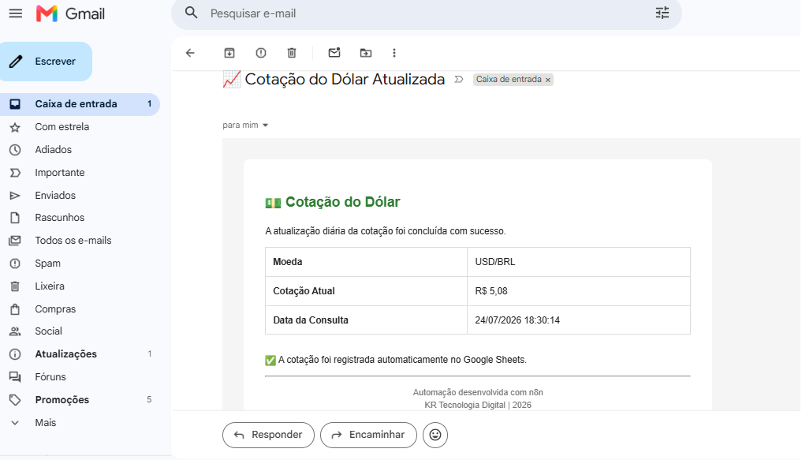

# 💵 Cotação do Dólar Automatizada com n8n

Automação desenvolvida com **n8n** para consultar diariamente a cotação do dólar americano (USD/BRL) através da **AwesomeAPI**, tratar os dados recebidos, registrar o histórico em uma planilha do **Google Sheets** e enviar uma notificação automática por e-mail utilizando SMTP.

## 📌 Objetivo

Este projeto demonstra como integrar uma API REST a um serviço em nuvem utilizando o n8n, automatizando a coleta e o armazenamento de informações sem necessidade de intervenção manual.

A automação é executada diariamente às **09:00**, consulta a cotação atual do dólar e adiciona uma nova linha na planilha com o valor e a data da consulta.

---

## 🚀 Tecnologias utilizadas

- n8n
- REST API
- AwesomeAPI
- Google Sheets API
- Google Service Account
- SMTP
- HTML Email Template
- JSON

---

## 🏗 Arquitetura

```text
Agendamento Diário
        │
        ▼
Consulta AwesomeAPI
        │
        ▼
Extração e Tratamento dos Dados
        │
        ├──────────────► Google Sheets
        │
        ▼
        Envio de E-mail SMTP
```

---

## ⚙ Fluxo da automação

1. O Schedule Trigger inicia o workflow diariamente às 09:00.
2. A AwesomeAPI fornece a cotação atual do dólar.
3. O node **Extrair Dados** seleciona e trata as informações necessárias.
4. A data é formatada no padrão brasileiro.
5. Os dados são gravados automaticamente em uma planilha do Google Sheets.
6. Um e-mail é enviado via SMTP com o resumo da cotação diária.

---

## 📂 Estrutura do projeto

```text
cotacao-dolar-n8n
│
├── workflow/
│   └── cotacao-dolar-n8n.json
│
├── imagens/
│   ├── workflow-n8n.png
│   ├── google-sheets.png
│   └── email-recebido.png
│
├── README.md
└── LICENSE
```

---

## 📸 Demonstração

### Workflow n8n
*Mostra a arquitetura completa da automação:*
- Agendamento diário
- Consulta da API
- Tratamento dos dados
- Registro no Google Sheets
- Envio do e-mail



 

### 📊 Histórico no Google Sheets ###
*Demonstra o armazenamento automático da cotação:*




### 📧 Notificação por e-mail ###
*Mostra o resultado final entregue ao usuário:*



---

## ▶ Como executar

1. Clone este repositório.
2. Importe o workflow no n8n.
3. Configure sua credencial do Google Sheets (Service Account).
4. Compartilhe a planilha com o e-mail da Service Account.
5. Ative o workflow.
6. Aguarde a execução agendada ou execute manualmente.

---

## 📚 Aprendizados

Durante o desenvolvimento foram aplicados conceitos de:

- Consumo de APIs REST
- Manipulação e transformação de dados
- Integração com serviços Google
- Automação de processos com n8n
- Comunicação automática via SMTP
- Construção de workflows escaláveis

---

## 💡 Melhorias futuras

- Implementação de tratamento de falhas com Error Workflow do n8n
- Registro de logs das execuções
- Integração com banco de dados
- Criação de dashboard de acompanhamento

---

## 👨‍💻 Autor

**Kleber Rafael**

**Analista Fiscal Tech | Desenvolvedor Fullstack | Inteligência Artificial e Automação**

LinkedIn: https://www.linkedin.com/in/kleber-rafael-silva/

GitHub: https://github.com/KleberRafael1/

